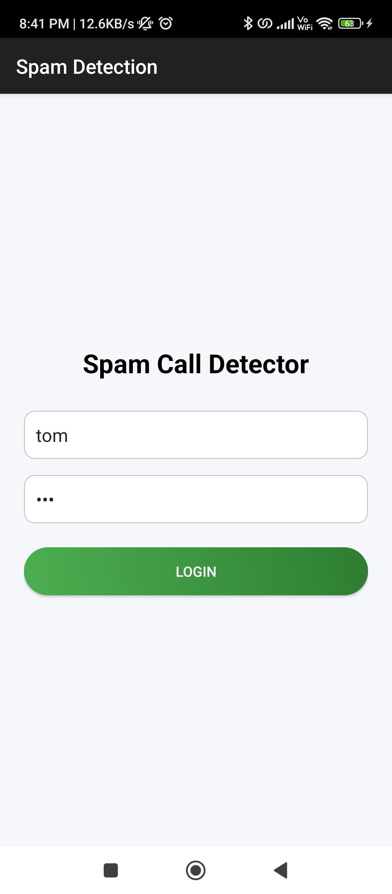
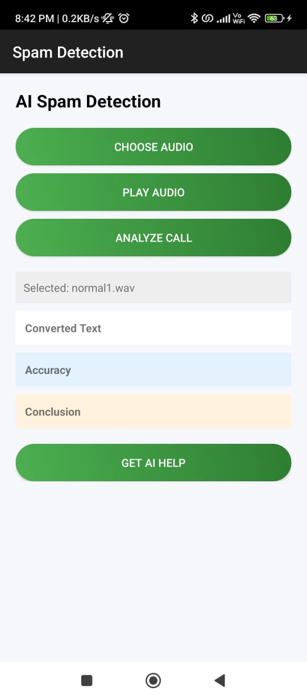
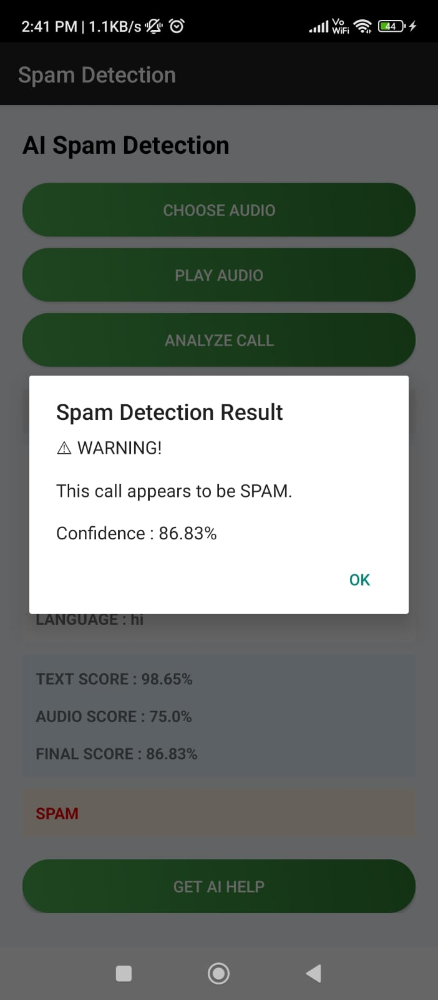
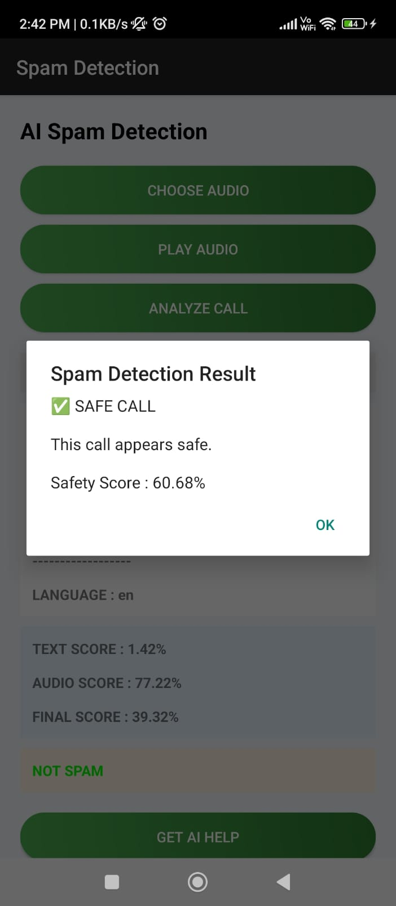
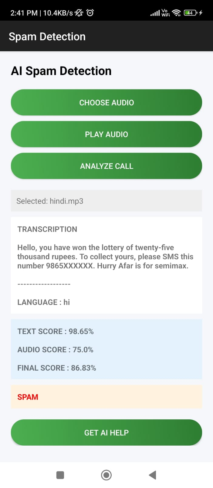
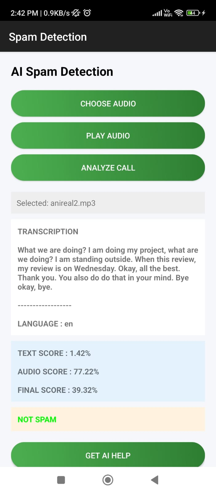
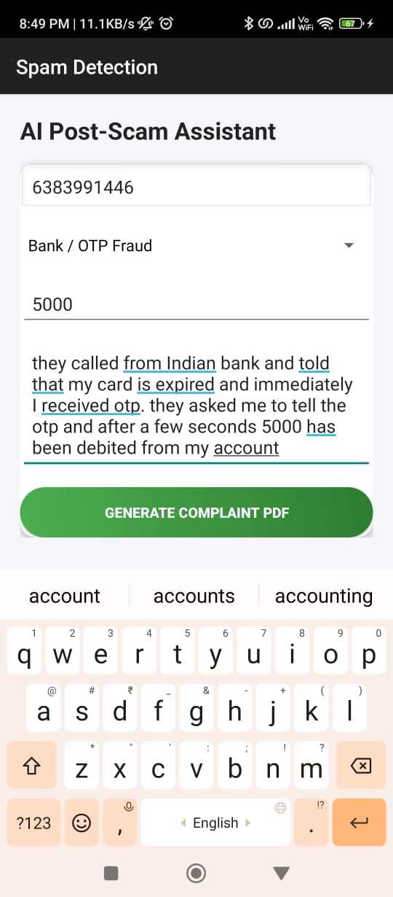
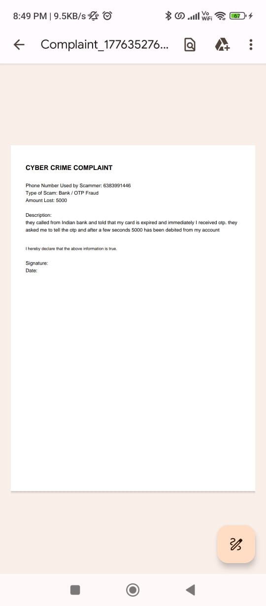

# Intelligent AI-Based Spam Call Detection System

An AI-powered spam call detection system that combines Speech Recognition, Natural Language Processing (NLP), and Machine Learning to identify fraudulent or spam calls. The project analyzes both the voice characteristics and conversation content to provide accurate spam detection and supports multilingual call analysis.

## 🚀 Project Overview

The Intelligent AI-Based Spam Call Detection System is designed to protect users from fraudulent and unwanted calls by leveraging AI techniques. The system transcribes call audio, detects the language, translates non-English conversations, and performs spam classification using both audio and text analysis models. The project demonstrates the practical application of Machine Learning, Deep Learning, and NLP in cybersecurity and communication systems.

## ✨ Key Features

### 📞 Spam Call Detection

* Real-time spam and legitimate call classification
* Multimodal analysis using audio and text data
* Confidence-based spam prediction scoring

### 🎙 Speech Processing

* Speech-to-text transcription using Whisper
* Automatic language detection
* Support for multilingual call conversations
* Translation of non-English calls into English

### 🤖 AI & Machine Learning

* Text-based spam detection using DistilBERT
* Audio-based spam detection using MFCC feature extraction
* Combined prediction using audio and text models
* Probability-based spam scoring

### 📄 Complaint Management

* Generate complaint reports
* Complaint PDF generation
* Store and manage spam call records

## 🖼️ Project Screenshots

### 🔐 Login Page

### 🏠 Home Page

### 📞 Spam Call Prediction

### ☎️ Normal Call Detection

### 📝 Spam Call Transcription

### 📄 Normal Call Transcription

### 📋 Complaint Form

### 📑 Generated Complaint PDF

## 🏗️ System Workflow

1. User uploads or records a call.
2. Audio is converted into WAV format.
3. Whisper transcribes the conversation.
4. Language is detected automatically.
5. Non-English conversations are translated into English.
6. DistilBERT performs text-based spam classification.
7. MFCC features are extracted from the audio.
8. Audio classification model predicts spam probability.
9. Both predictions are combined to generate the final result.
10. The system displays Spam or Not Spam with confidence scores.

## 💡 Novelty

Unlike traditional spam detection systems that rely solely on blacklists or text analysis, this project adopts a multimodal approach by combining voice characteristics and conversation content, resulting in more reliable and intelligent spam call detection.

## 🏗️ Tech Stack

### Frontend

* Android Studio
* Java
* XML

### Backend

* Python
* FastAPI

### Machine Learning & AI

* Whisper
* DistilBERT
* TensorFlow
* Keras
* PyTorch
* Librosa
* NumPy

### Additional Tools

* Google Translator API
* Pydub
* FFmpeg

## 👩‍💻 Author

**Kaviya B**

GitHub: **kaviya257**

## ⭐ If you like this project

Give a ⭐ to support the project and improve visibility!
